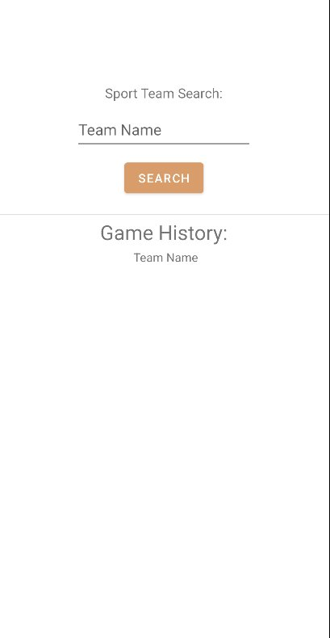
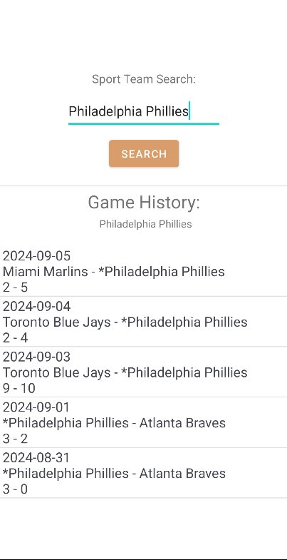
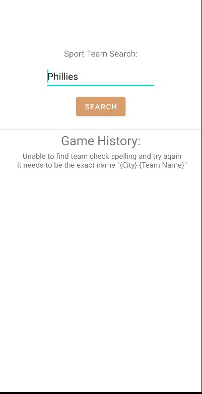

# SportDataAPI
 Application that uses thesportsdb.com Database API   
 To search the Game History of a Team and Retrieve the Recent Scores  
 
 
## Screen Shots
Start Menu  

 Game History 

 Incorrect Name 

## Built With
* Android Studio  
* Maven
* Learned with google Searching, and youtube
* www.thesportsdb.com as API Database

## Author
Project Coded by - Bailey Heck

## License
This project is licensed under the MIT License.

## Acknowledgments
Project idea From - ReachMobi

## History
Made as a Test for an Android Job at ReachMobi  
I Learned how to use koltin and common Archetecture Practices  
that are used in the Production of Applications.

## Key Programming Concepts Utilized
I learned Koltin, API Calls, and the MVVM Archetecture.
